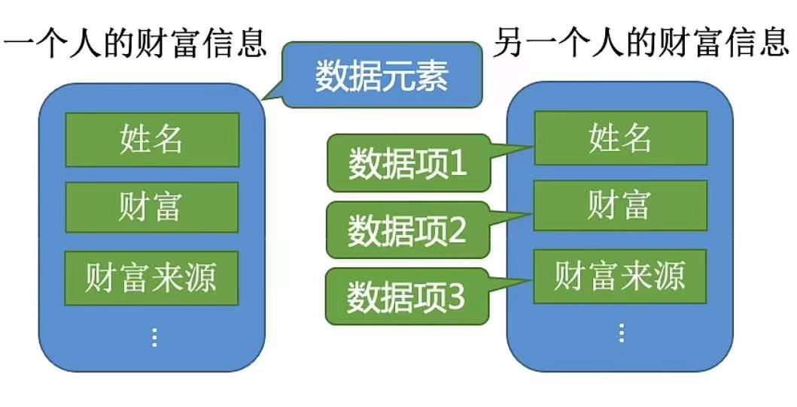
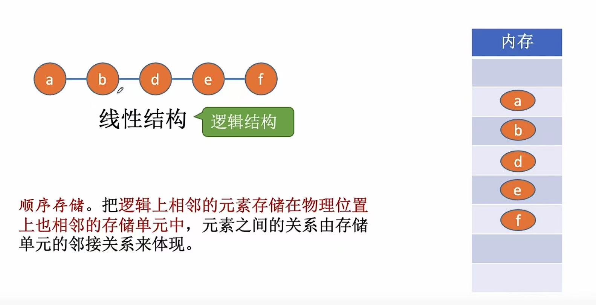
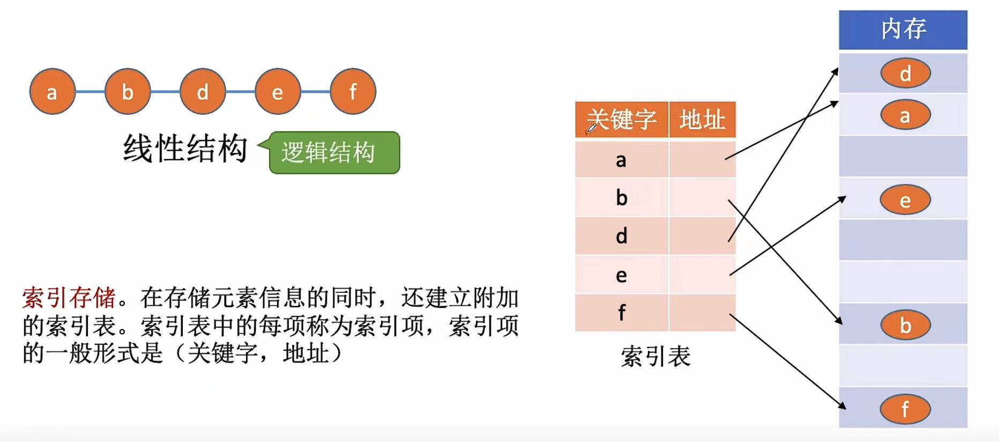
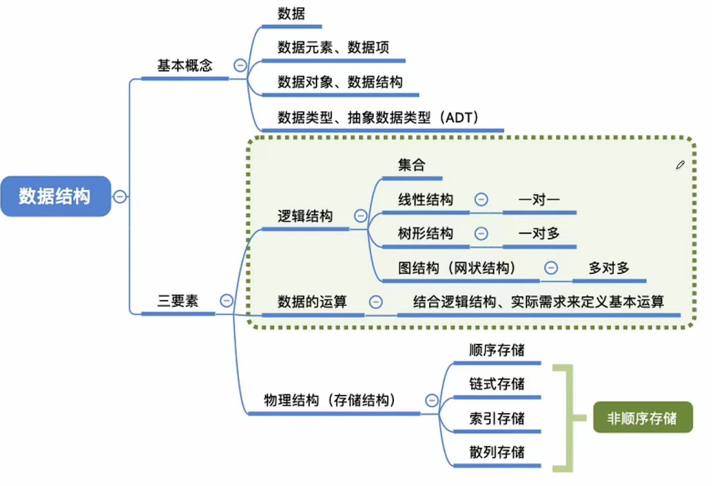
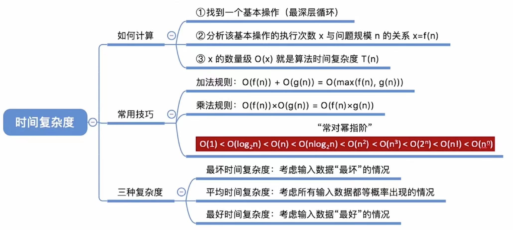

#  1.  绪论

**需要具备的知识：C/C++语言**

1. 什么是分支、循环（if/else,for,while）
2. 什么是数组
3. 什么是函数
4. 什么是指针，什么是地址
5. 什么是struct结构体

## 1.1.数据结构

### 1.1.1.数据结构的基本概念

**数据**：数据是信息的载体，是描述客观事物属性的**数、字符以及所有能输入到计算机中并被计算机程序识别和处理的符号的集合**。数据是计算机程序加工的原料（计算机专业人员用数据描述世界）

**早期计算机处理数据 —— 用于处理纯数值型问题**：世界上第一台通用计算机ENIAC是战争的产物（用于快速计算弹道轨迹等复杂的数学计算问题）

**现代计算机处理的数据 —— 经常处理非数值型问题**

对于非数值型的问题：

1. 关心每个个体的具体信息

   数据元素 、数据项—— 描述一个个体

   **数据元素、数据项：**

   数据元素是数据的基本单位，通常作为一个整体进行考虑和处理

   一个数据元素可由若干个数据项组成，数据项是构成数据元素的不可分割的最小单位

   

   **数据对象**：具有相同性质的数据元素的集合，是数据的一个子集

   

2. 关心个体与个体之间的关系

   数据结构 —— 个体之间的关系

   **数据结构**：是相互之间存在一种或多种特定关系的数据元素的集合

   <注意区分数据对象和数据结构> 

   <同样的数据元素，可以根据不同的关系标准组成不同的数据结构>

   <不同的数据元素，可以组成相同的数据结构（微博粉丝排行榜：线性关系、微博好友关系：网状关系）>

**数据结构这门课着重关注的是数据元素之间的关系，和对这些数据元素操作，而不关心具体的数据项内同**

### 1.1.2.数据结构的三要素：

<逻辑结构和数据的运算是定义一种数据结构，物理结构是实现这种数据结构>

1. **逻辑结构**

   - **集合结构**

     各个元素同属于一个集合，别无其它关系（非重点）

   - **线性结构** —— 一对一

     

     除了第一个元素，所有元素都有唯一前驱；除了最后一个元素，所有元素都有唯一后继

   - **树形结构** —— 一对多

   - **图状结构** —— 多对多

2. **数据的运算**

   针对于某种逻辑结构，结合实际要求，定义**基本运算**

   eg.针对线性结构经常用到的基本运算有

   - 查找第i个数据元素
   - 在第i个位置插入新的数据元素
   - 删除第i个位置的数据元素

3. **物理结构**（存储结构）：在计算机内表示出数据元素的逻辑关系

   <链式存储、索引存储和散列存储都是非顺序存储(离散存储)>

   - **顺序存储结构**（需要一整片连续的空间）

     <以线性存储结构为例>

     *把逻辑上相邻的元素存储在物理位置上也相邻的存储单元中*，元素间的关系由存储单元的邻接关系来体现

     

   - **链式存储结构**

     *逻辑上相邻的元素在物理位置上可以不相邻*，借助指示元素存储地址的指针来表示元素之间的逻辑关系

     

   - **索引存储结构**

     在存储元素信息的同时，还建立附加的索引表。索引表中的每项称为索引项，索引项的一般形式是（关键字，地址）

     

   - **散列存储结构**

     根据元素的关键字直接计算出该元素的存储地址，又称哈希存储

   **补充**：**数据类型、抽象数据类型**

   **数据类型**：是一个**值的集合**和**定义在此集合上的一组操作**的总称

   1. **原子类型**：其值不可再分的数据类型

      

   2. **结构类型**其值可以再分解为若干成分（分量），且分量之间具有一定的逻辑关系的数据类型

      

   **抽象数据类型**（ADT）：是**抽象数据组织**及**与之相关的操作**

   

   **知识回顾与重要考点**

   

## 1.2.算法

### 1.2.1.算法的基本概念

- **什么是算法**

  

  算法是对特定问题求解步骤的一种描述，它是指令的有限序列，其中的每条指令表示一个或多个操作

- **算法的五个特质**

  1. **有穷性**：一个算法必须总在执行有穷步骤之后结束，且每一步都可在又穷时间内完成

     **算法必须是有穷的**(用有限的步骤解决某个特定的问题)，而**程序可以是无穷的**(eg.微信是程序不是算法,它能无穷无尽地运行下去)

  2. **确定性**：算法中每条指令必须有确切的含义（无歧义），对于相同的输入只能得到相同的输出

  3. **可行性**：算法描述中地操作都可以通过已经实现的基本运算执行有限次来实现

  4. **输入**：一个算法有零个或多个输入，这些输入取自于某个特定的对象的集合

  5. **输出**：一个算法有一个或多个输出，这些输出是与输入有着某种特定关系的量

- **“好”算法的特质**

  1. **正确性**：算法能够正确地求解问题

  2. **可读性**：可读性强，易于理解（提供注释）

  3. **健壮性**：当输入非法数据的时候，算法能够适当地做出反应或进行处理，而不会产生莫名其妙的结果

  4. **高效率和低存储量需求**

     **时间复杂度**   &    **空间复杂度**

**知识回顾与重要考点**

### 1.2.2.算法的时间复杂度

时间复杂度：程序的执行次数，而不是运行所花的时间

只保留最高阶，且系数为1

用大O表示法（大O表示“同阶”，同等数量级）

时间复杂度判断（常对幂指阶）

**知识点总结**

### 1.2.3.算法的空间复杂度

空间复杂度：变量的个数

函数的递归调用所带来的内存开销

